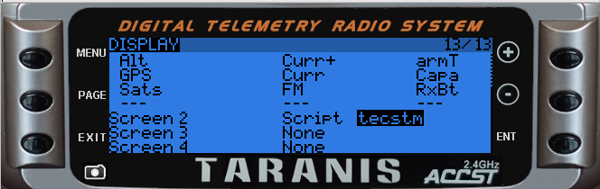
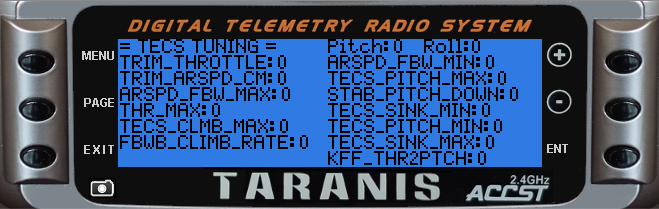

# Arduplane TECS tuning helper

### Description
This OpenTX LUA script will navigate you through the steps to tune your plane TECS.
The data will be processed and reformatted to Ardupilot parameter units (KPH->m/s) on the Transmitter directly.
Finally the TECS will be displayed on the screen and saved to a logfile.

This is based on Yaapu's [FrSky Telemetry Script](https://github.com/yaapu/FrskyTelemetryScript/). 
Before you continue, make sure you have everything set up on Arduplane and your RC Link to have this working.

It requires some custom sounds but still uses the built-in numbers and units on callouts.
Complete soundpacks (including the TECS sounds) can be found here: [OpenTX_soundpacks](https://github.com/mf0o/OpenTX_soundpacks)
A description of filenames and text are located in assets/custom_sounds.csv

The script is running in a loop of:

* read instructions of next step
* wait for you to get the plane in the desired state, attitude or speed
* save the related attributes

Each step is triggered by the configured switch and will update the TECS which are displayed on the telemetry screen.

The process can not be paused or aborted but repeated as many times as wished.

### Installation
* Copy tecs.lua to your SD-card /SCRIPTS/FUNCTIONS
* Copy tecstm.lua to your SD-card /SCRIPTS/TELEMETRY
* Choose your prefered voice and copy the custom sounds from sounds/\<voice-of-your-choice\>.zip to your SD-card /SOUNDS/en/
* replace your yaapu*.lua from the models telemetry screen with "tecstm" 
	* 
	* (Although the script is based on Yaapu FrSky Telemetry Script 1.9.5, it cant be used simulatenously)
* set up a switch in SPECIAL FUNCTION to trigger the script (momentary switch recommended)
	* 

### Operation

**! You are 100% of the time in control and responsible for your plane !**

*There is no need to do any risky manouvers, you can abort at any time and re-gain altitude etc. or cycle through the menu and start over again*

* open the telemetry screen on your remote, it will have 0s in all parameters
	* 
* launch your plane and ascend to a comfortable altitude, then switch to FBWA
* engage your switch
	* 	follow the instructions and get _and_ hold the plane in the requested attitude and/or speed
	*  engage the switch again
	*  repeat
*  Once done your TECS screen should be filled with numbers
*  a logfile named "tecs.txt" will be written to the SD card, holding the numbers too
*  Use MissionPlanner, QGroundControl or [Parachute](https://gitlab.com/stavros/parachute) to update your configuration

### Process

###### ... with many thanks to:
* [https://github.com/yaapu](https://github.com/yaapu)
* [https://github.com/shellixyz](https://github.com/yaapu)
* [https://github.com/skorokithakis](https://github.com/yaapu)

> Disclaimer:
> 
> Use on own risk without any warranty!

