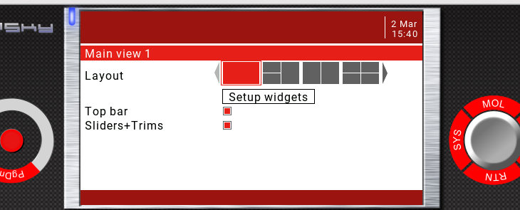
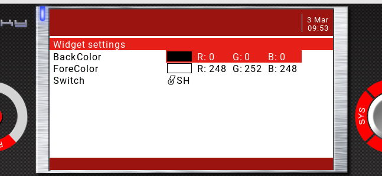
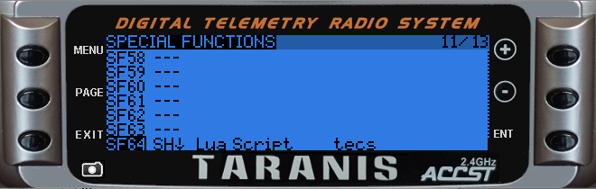
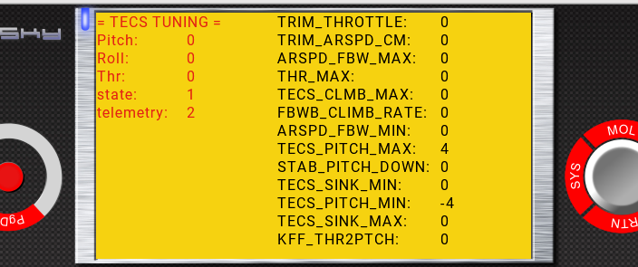

# Arduplane TECS tuning helper

### Description
This OpenTX LUA script will navigate you through the steps to tune your plane TECS.
The data will be processed and reformatted to Ardupilot parameter units (i.e. dm/s->kph) on the Transmitter directly.
Finally the TECS will be displayed on the screen and saved to a logfile.

This is based on Yaapu's [FrSky Telemetry Script](https://github.com/yaapu/FrskyTelemetryScript/). 
Before you continue, make sure you have everything set up on Arduplane and your RC Link to have this working (passthrough telemetry).

It requires some custom sounds but still uses the built-in numbers and units on callouts.
The sound files are provided in /SOUNDS/ but matching, complete soundpacks (including the TECS sounds) can be found here: [OpenTX_soundpacks](https://github.com/mf0o/OpenTX_soundpacks)
A description of filenames and text are located in assets/custom_sounds.csv

The script is running in a loop of:

* read instructions of next step
* wait for you to get the plane in the desired state, attitude or speed
* save the related attributes

Each step is triggered by the configured switch and will update the TECS which are displayed on the telemetry screen.

The process can not be paused or aborted but repeated as many times as needed.

### Summary
* CRSF only as of today
* read airplane telemetry
* step-by-step instructions for tuning the TECS
* single switch operation
* show TECS parameter in Arduplane format and unit on screen
* write logfiles to /LOGS/tecs_\<timestamp\>.txt

### Installation Horus
* [temporary] set FRSKY_OPTIONS=0 on Arduplane to get airspeed data 
* copy WIDGETS/TECS/main.lua to your SD card
* Choose your prefered voice and copy the custom sounds from SOUNDS/\<voice-of-your-choice\>.zip to your SD-card /SOUNDS/en/
* unload/remove yaapu Telemetry Script temporarily from the active Widgets List
* load the TECS widget as fullscreen widget

* [optionally] enter "widget settings" and choose your switch to initiate the next step. Default is SH

* reboot your radio
* your should see those red numbers changing when moving your aircraft

### Installation x9D /Q7 etc.
* [temporary] set FRSKY_OPTIONS=0 on Arduplane to get airspeed data 
* Copy tecs.lua to your SD-card /SCRIPTS/FUNCTIONS/
* Copy tecstm.lua to your SD-card /SCRIPTS/TELEMETRY/
* Choose your prefered voice and copy the custom sounds from sounds/\<voice-of-your-choice\>.zip to your SD-card /SOUNDS/en/
* replace your yaapu* from the models telemetry screen with "tecstm" 

	* (Although the script is based on Yaapu FrSky Telemetry Script 1.9.5, it cant be used simulatenously)
* set up a switch in SPECIAL FUNCTION to trigger the script (momentary switch recommended)

* open your telemetry screen and validate that Pitch and Roll updating accordingly to aircraft movement

### Operation

**! You are 100% of the time in control and responsible for your plane !**

*There is no need to do any risky manouvers, you can abort at any time and re-gain altitude etc. or cycle through the menu and start over again*

* open the telemetry screen on your remote, it will have 0s in all parameters
	* 
	* 
* launch your plane and ascend to a comfortable altitude, then switch to FBWA
* engage your switch
	* 	follow the instructions and get _and_ hold the plane in the requested attitude and/or speed [**give the telemetry here 1 or 2 second to update**]
	*  engage the switch again
	*  repeat
*  Once done your TECS screen should be filled with numbers
*  a logfile will be written to /LOGS/tecs_<timestamp>.txt
*  Use MissionPlanner, QGroundControl or [Parachute](https://gitlab.com/stavros/parachute) to update your configuration

### Process

### Release notes
* v0.0.6     26.01.2022	workflow seems to be working, no telemetry support yet
* v0.0.7     28.02.2022	adding global variable telemetry, making TECS globally available for tecstm.lua
* v0.0.8	  01.03.2022	correcting TECS_PITCH_MAX
* v0.0.9	  01.03.2022	added 4 deg margin to TECS_PITCH_MIN and TECS_PITCH_MAX
* v0.1.0	  01.03.2022	changed procedure for ARSPD_FBW_MIN from circle to straight without a security margin
* v0.1.1	  02.03.2022	logfiles will be written with timestamp
* v0.1.2	  02.03.2022	setting default to 0 for TECS_PITCH_MAX&TECS_PITCH_MIN
* v0.1.3	  03.03.2022	adding post-step-status sounds
* v0.1.4	  03.03.2022	correcting hSpeed to airspeed as telemetry source
* v0.2.0	  06.03.2022 airspeed will be read from telemetry.hSpeed again, more unit convertion (dm/s to kph and m/s), logging timestamp updated, adding debug option to log raw values

##### additional Resources
[https://ardupilot.org/plane/docs/tecs-total-energy-control-system-for-speed-height-tuning-guide.html
](https://ardupilot.org/plane/docs/tecs-total-energy-control-system-for-speed-height-tuning-guide.html)[https://notes.stavros.io/ardupilot/tuning-the-tecs/](https://notes.stavros.io/ardupilot/tuning-the-tecs/)
[https://notes.stavros.io/ardupilot/tecs-tuning-calculator/](https://notes.stavros.io/ardupilot/tecs-tuning-calculator/)

###### ... with many thanks to:
* [https://github.com/shellixyz](https://github.com/shellixyz)
* [https://github.com/yaapu](https://github.com/yaapu)
* [https://github.com/skorokithakis](https://github.com/skorokithakis)

> Disclaimer:
> 
> Use on own risk without any warranty!

